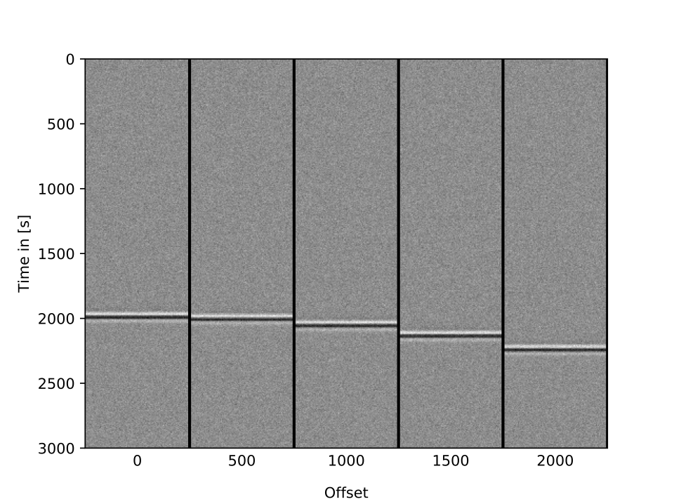
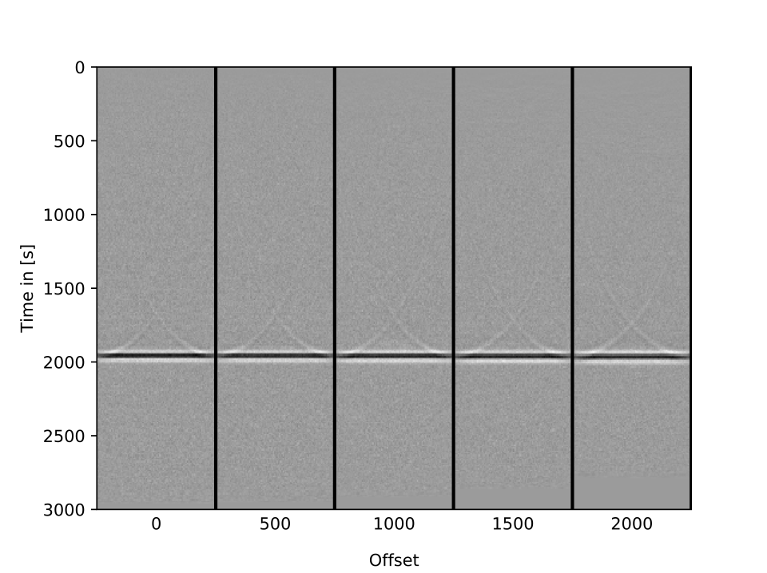
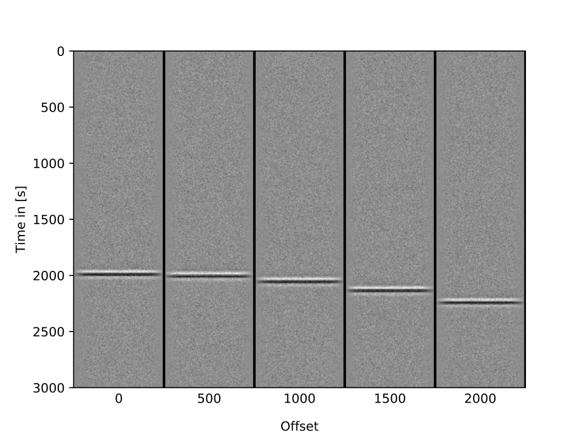
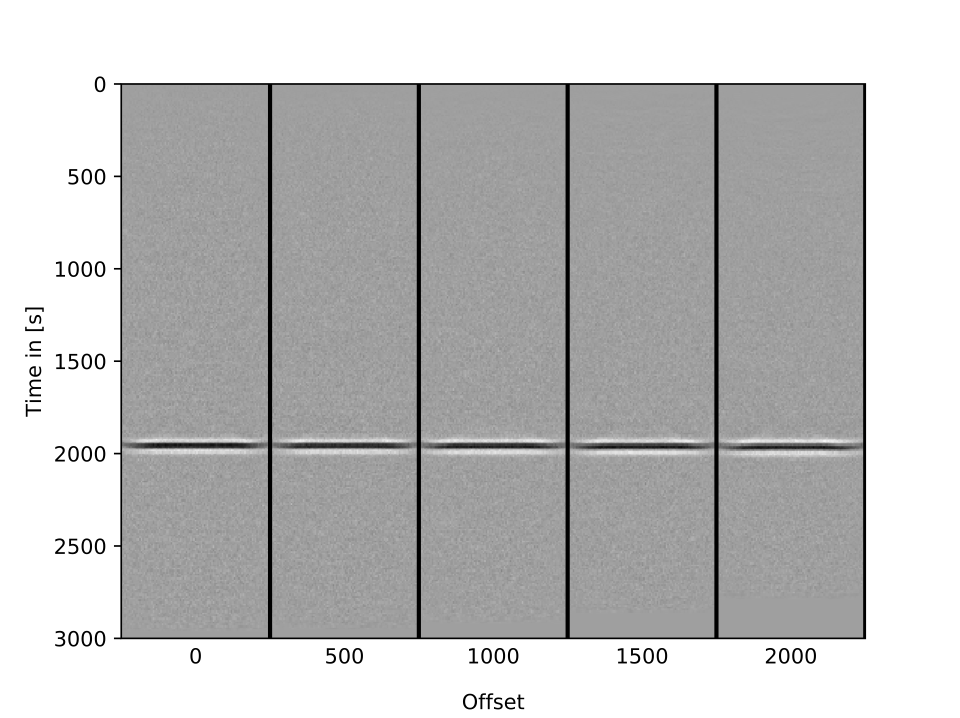

Simple implementation of [Kirchhof seismic migration](https://en.wikipedia.org/wiki/Seismic_migration) in Python/Cython.

## usage:

```
make cython
make run
```

#### Original data



#### Migrated data



There are some artifacts visible, which we can improve by tapering the edges:

#### Tapered original data



#### Migrated taperad data


